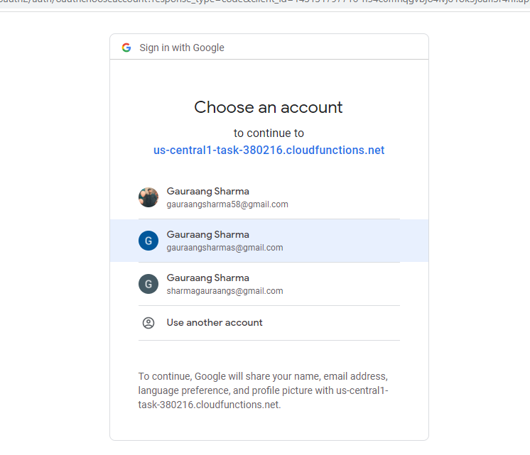

# Google Cloud Functions Project
This project is a Google Cloud Functions based project that has three functions defined in separate folders. The functions are named signin, calendar, and fetchevents, and each function has its specific purpose.

### Similar project built using flask: https://github.com/zigbee-s/flask-calendar-event-api.git

# Project Overview
- The signin function performs user OAUTH and stores their credentials in a database.
- The calendar function allows a user to pass in a start date, end date, and their email. It further makes a post request with the data to the fetchevents function.
- The fetchevents function verifies the dates, and checks whether the user with the provided email has credentials within the database or not. If not, it redirects to the signin page. Otherwise, it queries the Google Calendar API and returns a list of events.

# Steps to Set up the Project
1. Create a MongoDB instance and make it accessible through all IP addresses.
2. Visit google cloud console and create an OAUTH consent screen and credentials, providing access to calendar in the scope, and add test users.
3. Create three empty Cloud Functions in Python runtime named: signin, calendar, and fetchevents, and get their trigger links. Ensure that you provide access to everyone, not just IAM users.
4. Use the above database URI, OAUTH credentials, and function triggers to configure the config.py file in each function's code.
5. Move into the folders of each Cloud Function code and make a zip file of their code files.
6. Use these zip files to update the respective Cloud Functions by uploading the zips.

# Requirements
Python 3.x
Google Cloud Functions
Google Calendar API
MongoDB instance
Flask
Requests
PyMongo

# Screenshots
- Index page after signin

- Calendar function

- Fetched Events

- Prompt to visit the url and signin

- Oauth page

